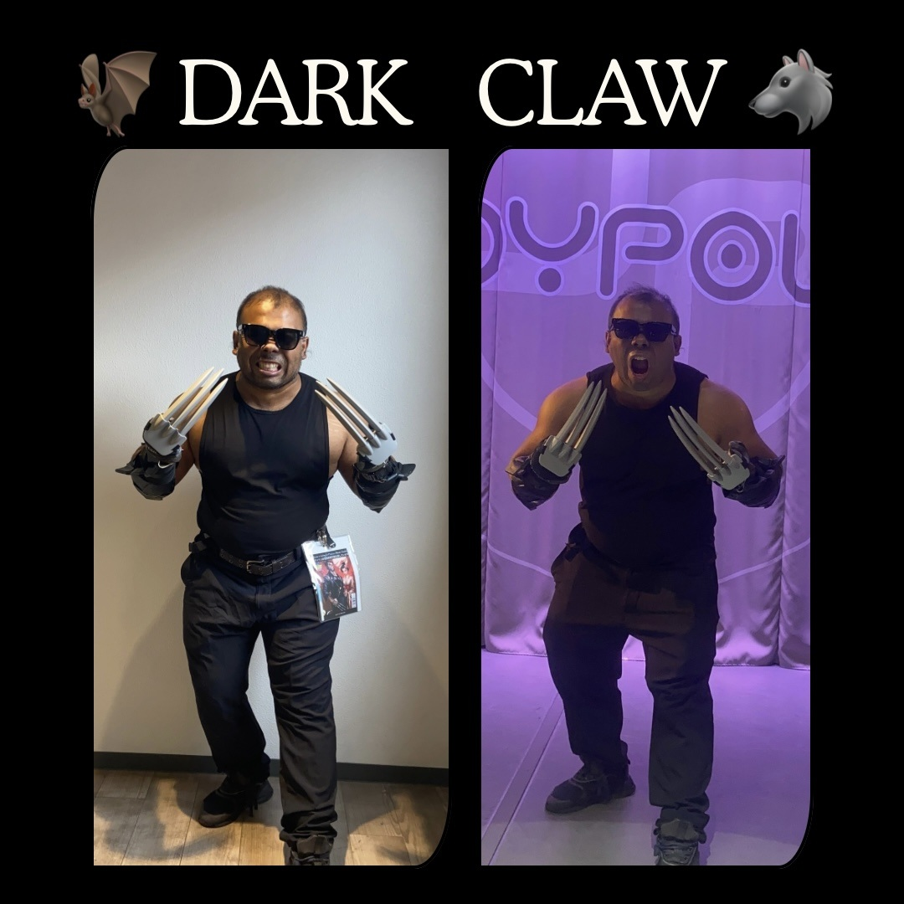

# dark-claw

Dark Claw is an original fitness-based cosplay concept created by Khan (カーン), based in Japan.
This repository contains the source code for the official Dark Claw website—designed for presence, strength, and silence.

Built with semantic HTML, modern CSS, and SEO-optimized structured data, the site focuses on clarity, performance, and long-term stability rather than trends or frameworks.

## 📸 Preview

## Concept principles:

- Original character (no licensed IP)

- Strength-driven silhouette

- Minimal narrative, maximum presence

- Designed to be felt, not explained

## Tech Stack

- HTML5 (semantic, accessible)

- CSS3 (custom dark theme, responsive)

- Structured Data (JSON-LD, Schema.org)

- Optimized for GitHub Pages

## Live Site

👉 https://csemahmud.github.io/dark-claw/

## Disclaimer

Dark Claw is an original cosplay concept and is not affiliated with or endorsed by DC Comics, Marvel, or any other rights holders.